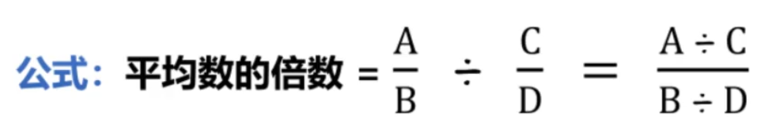

截位直除，一般取前2位有效数字，选项相近取前3位有效数字

两期比重：
  现期比重：A/B
  基期比重：(A/B)*((1+b)/(1+a))
  两期增长量比重：(A/B)*((a-b)/(1+a))
  两期增长率比重：(a-b)/(1+b)

两期平均：
  现期平均：A/B
  基期平均：(A/B)*((1+b)/(1+a))
  两期平均增长量比重：(A/B)*((a-b)/(1+a))
  两期平均增长率比重：(a-b)/(1+b)
  
  